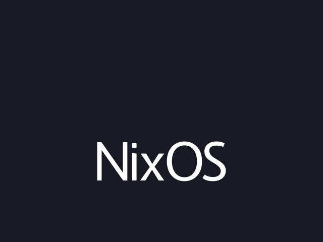
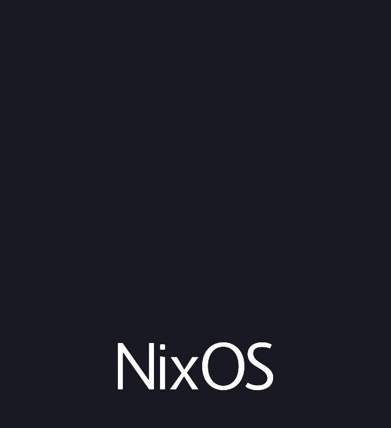

# NixOS Loading — Plymouth Theme

A Plymouth boot splash theme for NixOS. The "NixOS" wordmark appears at boot, then the 6 lambda arms of the snowflake logo are revealed one-by-one clockwise as boot progresses — forming the complete logo by the time the system is ready.

Available in 3 color variants: **default** (blue gradient), **rainbow**, and **white**.

## Preview

| Default (blue gradient) | Rainbow | White |
|:-:|:-:|:-:|
|  |  |  |

## Installation

### NixOS Flake (recommended)

Add as a flake input and import the module:

```nix
{
  inputs = {
    nixpkgs.url = "github:NixOS/nixpkgs/nixos-unstable";
    nixos-loading-plymouth.url = "github:<owner>/nixos-load-plymouth";
  };

  outputs = { nixpkgs, nixos-loading-plymouth, ... }: {
    nixosConfigurations.myhost = nixpkgs.lib.nixosSystem {
      modules = [
        nixos-loading-plymouth.nixosModules.default
        {
          # Optional: choose a variant (default is "default")
          boot.plymouth.nixos-loading.variant = "rainbow"; # or "default" or "white"
        }
        # ... your other modules
      ];
    };
  };
}
```

The module enables Plymouth and sets the theme automatically.

### Manual Package Selection

If you prefer not to use the module, you can add the theme package directly:

```nix
{
  boot.plymouth = {
    enable = true;
    theme = "nixos-loading-default"; # or "nixos-loading-rainbow" / "nixos-loading-white"
    themePackages = [
      nixos-loading-plymouth.packages.${pkgs.system}.nixos-loading-default
    ];
  };
}
```

## Building

```bash
# Build the default (blue gradient) theme
nix build

# Build a specific variant
nix build .#nixos-loading-rainbow
nix build .#nixos-loading-white

# Generate GIF previews
nix build .#preview-default
nix build .#preview-rainbow
nix build .#preview-white
```

## Local Testing

```bash
nix develop  # provides rsvg-convert, imagemagick, plymouth

sudo plymouthd --tty=/dev/tty1
sudo plymouth show-splash
# wait, then:
sudo plymouth quit
```

## How It Works

1. **Assets**: 6 individual lambda SVGs per variant in `assets/<variant>/`, plus a shared `assets/text.svg` NixOS wordmark
2. **Build**: `rsvg-convert` rasterizes each SVG to PNG at build time (lambdas at 512 px, text at 256 px)
3. **Animation**: Plymouth script shows "NixOS" text immediately, then fades in each lambda arm over its 1/6 progress segment (clockwise from top-left: 120° → 180° → 240° → 300° → 0° → 60°)
4. **Password prompt** (LUKS): displays the full logo with `●` bullet-masked input

## License

MIT